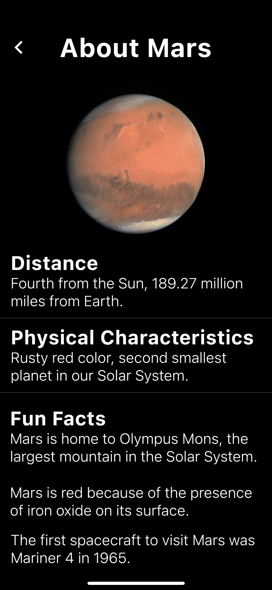

# Planetopedia 🪐

## NOTE: As of April 2021, this app is no longer available :(

Flutter app for learning about planets.
Released March 27, 2020

[Available on iOS, iPadOS, and macOS.](https://apps.apple.com/us/app/planetopedia/id1501920966)
